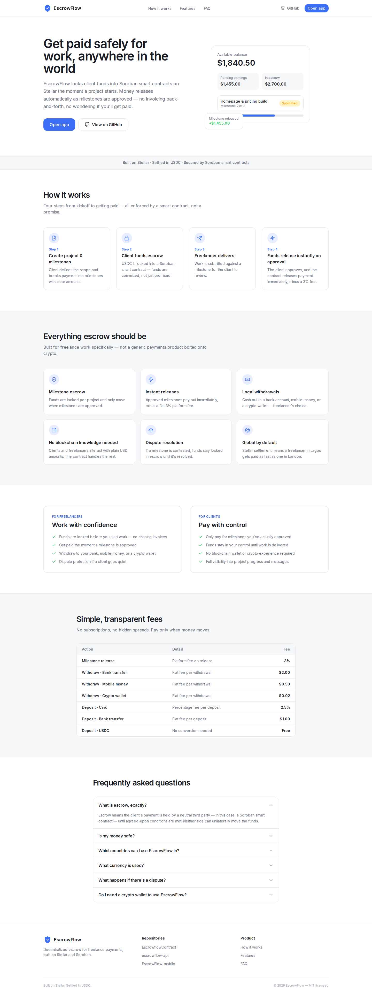
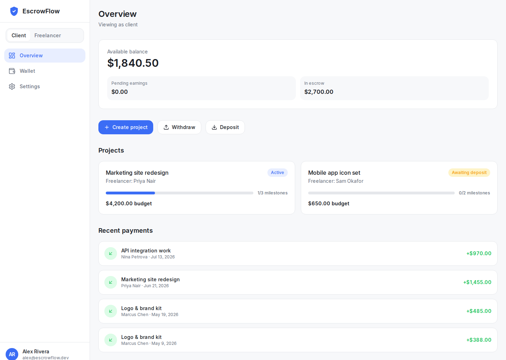
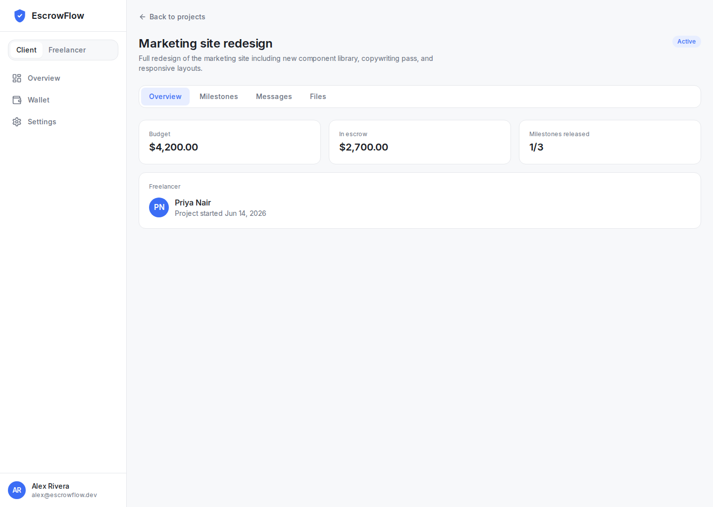
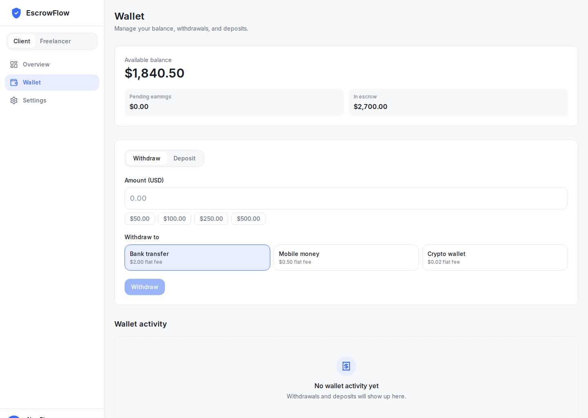
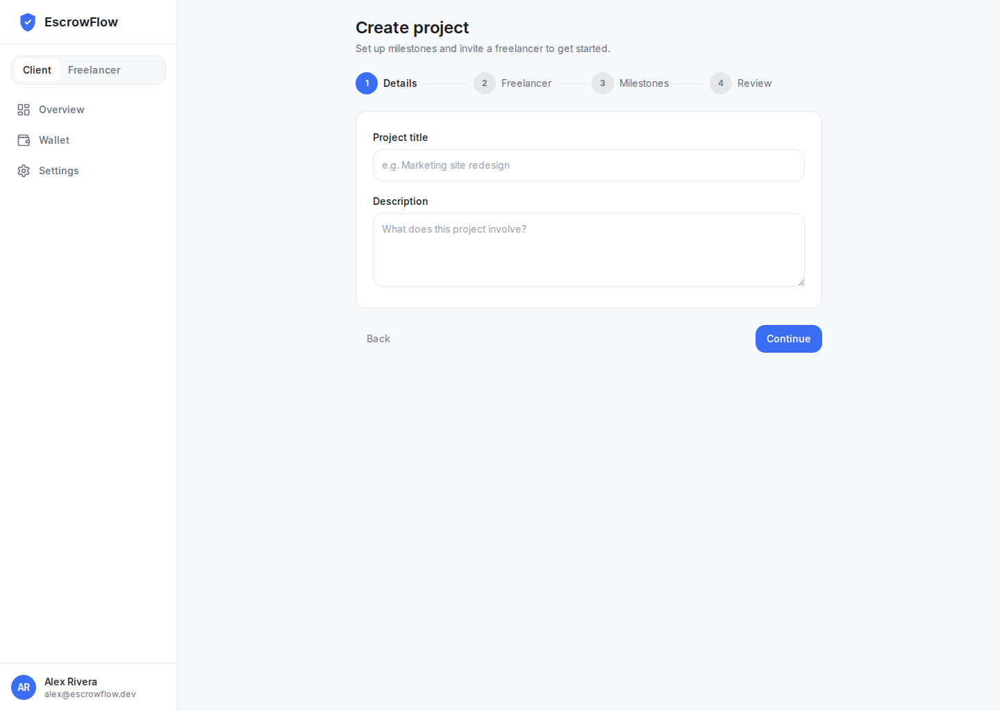

# EscrowFlow Frontend

The web frontend for **EscrowFlow** — a decentralized escrow platform for freelance
payments on [Stellar](https://stellar.org). Clients lock USDC into
[Soroban](https://soroban.stellar.org) smart contracts, funds release automatically as
milestones are approved, and freelancers withdraw to a local bank account, mobile money,
or a crypto wallet.

This repo serves two purposes:

1. A polished **public landing page** for the product.
2. A functional **web dashboard** mirroring the EscrowFlow mobile app, backed by a mock
   data layer so it runs standalone with no API dependency.

## Links

- **Live Demo:** [https://www.escrowflowhq.com](https://www.escrowflowhq.com) (Vercel production)
- **Local Development:** `npm run dev` → [http://localhost:3000](http://localhost:3000)
- **Backend Contract:** [https://stellar.expert/explorer/testnet/contract/YOUR_CONTRACT_ID](https://stellar.expert/explorer/testnet/contract/YOUR_CONTRACT_ID)
  <!-- TODO: replace YOUR_CONTRACT_ID with the deployed Soroban escrow contract's testnet ID before submission -->

## Features

- Role-based client/freelancer views
- KYC verification
- Stellar wallet integration
- Full escrow lifecycle (fund → milestone submission → approval → release → withdrawal)

## Screenshots

| Landing page | Dashboard overview |
| --- | --- |
|  |  |

| Project detail | Wallet |
| --- | --- |
|  |  |

| New project wizard |
| --- |
|  |

## Tech stack

- [Next.js 14](https://nextjs.org) (App Router), [React](https://react.dev), TypeScript (strict)
- [Tailwind CSS](https://tailwindcss.com)
- [Zustand](https://github.com/pmndrs/zustand) for dashboard state
- [lucide-react](https://lucide.dev) for icons
- Mock data layer (`src/lib/mock`) for standalone, API-free operation
- [Vitest](https://vitest.dev) + [Testing Library](https://testing-library.com) for tests

## Getting started

```bash
npm install
npm run dev
```

Open [http://localhost:3000](http://localhost:3000) for the landing page, or
[http://localhost:3000/app](http://localhost:3000/app) for the dashboard.

## Project structure

```
src/
  app/                  Next.js App Router pages
    page.tsx            Landing page
    app/                Dashboard (overview, projects, wallet, settings)
  components/
    landing/             Landing page sections
    dashboard/            Dashboard shell, cards, milestone/chat/file UI
    ui/                   Shared design-system primitives
  lib/
    types.ts             Shared domain types (mirrors the mobile app / API)
    fees.ts              Fee calculation helpers
    mock/                 Mock data seed + business-logic service
    store.ts             Zustand store wiring the UI to the mock service
    wizardValidation.ts  Pure validation logic for the "new project" wizard
```

## Mock data vs. a real API

The dashboard runs entirely on an in-memory mock service (`src/lib/mock/service.ts`) that
implements the same business rules as the mobile app: approving a milestone releases funds
minus the 3% platform fee and completes the project once every milestone is released;
submitting a milestone is blocked until the project's escrow is funded; withdrawals and
deposits apply the fee schedule for each destination/method.

This is controlled by `NEXT_PUBLIC_USE_MOCK` in `.env` (see `.env.example`). It currently
defaults to `true` since there is no live API yet — flip it to `false` once
`NEXT_PUBLIC_API_URL` points at a real EscrowFlow API to swap in real network calls.

## Scripts

| Command             | Description                          |
| -------------------- | ------------------------------------ |
| `npm run dev`        | Start the dev server                 |
| `npm run build`      | Production build                     |
| `npm run start`      | Serve the production build           |
| `npm run lint`       | ESLint                               |
| `npm run typecheck`  | `tsc --noEmit`                       |
| `npm test`           | Run the Vitest suite                 |

## Related repos

| Repo | Description |
| --- | --- |
| [EscrowflowContract](https://github.com/escrowflow-hq/EscrowflowContract) | Soroban smart contracts |
| [escrowflow-api](https://github.com/escrowflow-hq/escrowflow-api) | Backend API |
| [EscrowFlow-mobile](https://github.com/escrowflow-hq/EscrowFlow-mobile) | React Native mobile app |

## Deploying

The app deploys cleanly to [Vercel](https://vercel.com):

1. Import this repo into Vercel.
2. Set the environment variables from `.env.example` (`NEXT_PUBLIC_API_URL`,
   `NEXT_PUBLIC_USE_MOCK`) in the Vercel project settings.
3. Deploy — Vercel auto-detects Next.js, no custom build config needed.

## License

MIT © 2026 EscrowFlow — see [LICENSE](./LICENSE).
